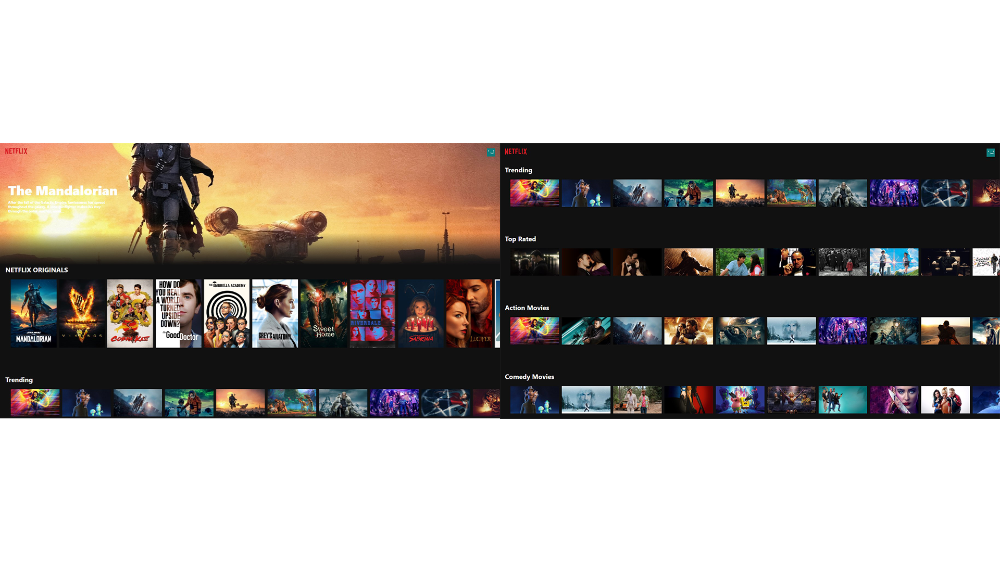

<h1 align="center">
    
</h1>

<h4 align="center"> 
	🚧  Netflix Trailers 🎥 Concluído 🚀 🚧
</h4>

<p align="center">
 <a href="#-sobre-o-projeto">Sobre</a> •
 <a href="#-funcionalidades">Funcionalidades</a> •
 <a href="#-layout">Layout</a> • 
 <a href="#-como-executar-o-projeto">Como executar</a> • 
 <a href="#-tecnologias">Tecnologias</a> • 
 <a href="#-autor">Autor</a>
</p>


## 💻 Sobre o projeto

🎥 Netflix Trailers - É um app que permite aos usuários visualizarem trailers de filmes e séries. O app utiliza inegração com a api [themoviedb](https://developers.themoviedb.org/3/getting-started/introduction).


O layout da aplicação é totalmente inspirado no próprio aplicativo da [Netflix](https://www.netflix.com/br-en/).

---

## ⚙️ Funcionalidades

- [x] Os usuários podem clicar em qualquer filme ou série que desejar, o que exibirá o respectivo trailer logo abaixo.
- [x] O banner da aplicação é atualizado para um filme ou série aleatório sempre que a página é atualizada.

---

## 🎨 Layout

<p align="center" style="display: flex; align-items: flex-start; justify-content: center;">
  
</p>

---

## 🚀 Como executar o projeto

### Pré-requisitos

Antes de começar, você vai precisar ter instalado em sua máquina as seguintes ferramentas:
[Git](https://git-scm.com), [Node.js](https://nodejs.org/en/). 
Além disto é bom ter um editor para trabalhar com o código como [VSCode](https://code.visualstudio.com/)

#### 🧭 Rodando a aplicação web

```bash

# Clone este repositório
$ git clone https://github.com/naMoraezDev/Listify-Front-End-App.git

# Acesse a pasta do projeto no seu terminal/cmd
$ cd Listify-Front-End-App-main

# Instale as dependências
$ npm install
ou
$ yarn install

# Execute a aplicação em modo de desenvolvimento
$ npm run start
ou
$ yarn start

# A aplicação será aberta na porta:3000 - acesse http://localhost:3000

```

---

## 🛠 Tecnologias

As seguintes ferramentas foram usadas na construção do projeto:

#### ([React](https://reactjs.org/))

-   **[React Dom](https://github.com/facebook/react/tree/master/packages/react-dom)**
-   **[testing-library/jest-dom](https://github.com/testing-library/jest-dom)**
-   **[testing-library/react](https://github.com/testing-library/react-testing-library)**
-   **[testing-library/user-event](https://github.com/testing-library/user-event)**
-   **[Axios](https://github.com/axios/axios)**
-   **[React Scripts](https://github.com/facebook/create-react-app/tree/master/packages/react-scripts)**
-   **[Movie Trailer](https://github.com/lacymorrow/movie-trailer)**
-   **[React Youtube](https://github.com/tjallingt/react-youtube)**

---

## 💪 Como contribuir para o projeto

1. Faça um **fork** do projeto.
2. Crie uma nova branch com as suas alterações: `git checkout -b my-feature`
3. Salve as alterações e crie uma mensagem de commit contando o que você fez: `git commit -m "feature: My new feature"`
4. Envie as suas alterações: `git push origin my-feature`

---

## 🦸 Autor

Feito com ❤️ por Gabriel Moraes 👋 [Entre em contato!](https://www.linkedin.com/in/gabriel-moraes-5572b2145/)
